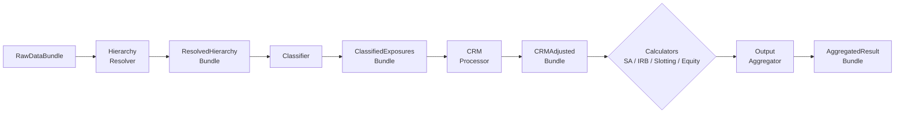

*Frozen bundles, structural protocols, lazy graphs, and accumulated errors are not Clean Architecture cosplay. They are the negative space that audit demands leave behind.*

Published 2026-05-12. Code references are pinned to commit [`7657a56`](https://github.com/OpenAfterHours/rwa_calculator/tree/7657a56).

---

This is post 2 in the series on building this UK Basel 3.1 RWA calculator. Post 1 ([Building a UK Basel 3.1 RWA Calculator in Public](2026-04-28-building-a-uk-basel-31-rwa-calculator-in-public.md)) sketched what the calculator does and why I am writing about it. This post is about the architecture — and specifically, about the parts of the architecture that look fussy until you understand what they are protecting.

## A small detail with a big tail

Earlier in the build, the calculator carried a scalar `eur_gbp_rate` on `CalculationConfig` — used by the IRB SME correlation formula in CRR Art. 153(4) and to derive GBP equivalents of EUR-denominated regulatory thresholds. It also accepted an `fx_rates` LazyFrame as input data, used to convert exposure / collateral / guarantee / provision amounts at the row level. Two FX mechanisms, related by anything other than convention.

A user could load a fresh `fx_rates.parquet` and get all amount columns converted at, say, 0.90, while the IRB SME correlation and the derived GBP thresholds continued to use the default 0.8732. Silently. The portfolio total would be subtly wrong, the audit trail would *look* internally consistent, and the discrepancy would only surface when someone ran two reports at different rates and noticed the SME bucket moved by less than the rest.

The fix, [shipped in 0.1.65](../appendix/changelog.md), was a `with_fx_rate()` method on `CalculationConfig` that rebuilds both the scalar *and* the `RegulatoryThresholds` together, plus an auto-sync from the loaded `fx_rates` table at pipeline entry, plus an opt-out flag, plus a WARNING log line when the auto-sync replaces a caller-supplied rate. The fix is six lines of logic and four lines of validation, but the architectural commitment behind it is not negotiable: **a value used in two regulatory formulas can never be allowed to drift between them.**

That is the kind of property a regulatory calculator has to make structurally impossible. The architecture below exists because of constraints like this one.

## The pipeline at a glance



Eight stages. Each consumes one immutable bundle and produces another. Loader pulls raw data from parquet, postgres, or memory and validates it. HierarchyResolver resolves counterparty, facility, and lending-group hierarchies, propagating ratings through the parent chain. Classifier assigns each exposure to an exposure class and an approach (SA, F-IRB, A-IRB, slotting, equity). CRMProcessor applies eligible collateral, guarantees, and provisions to produce a CRM-adjusted EAD and LGD. The four calculators each compute RWA on their slice. The OutputAggregator joins everything back together, applies the Basel 3.1 output floor, and produces the final result.

The orchestration lives in [`engine/pipeline.py`](https://github.com/OpenAfterHours/rwa_calculator/blob/7657a56/src/rwa_calc/engine/pipeline.py), about 740 lines. The data contracts are in [`contracts/bundles.py`](https://github.com/OpenAfterHours/rwa_calculator/blob/7657a56/src/rwa_calc/contracts/bundles.py), about 654 lines. The behavioural contracts — what each stage is allowed to do — are in [`contracts/protocols.py`](https://github.com/OpenAfterHours/rwa_calculator/blob/7657a56/src/rwa_calc/contracts/protocols.py), about 820 lines. There is no inheritance hierarchy, no DI container, no plugin framework. Bundles in, bundles out, and a script that refuses to let you commit code that breaks the rules.

## Why immutable bundles

I want to make three claims about why every bundle is `@dataclass(frozen=True)`. Each one falls out of a regulatory requirement, not from a design preference.

**Claim 1: you must be able to point at the exact input that produced a given output.** PRA SS1/23 (Model Risk Management) and CRR Articles 144 and 174 all require, in different language, that the assignment of an exposure to a grade and the production of a capital number be reproducible and auditable. The cheapest way to satisfy that is to make every stage's input a literal artifact you can serialise, hash, and replay. Frozen bundles are how you guarantee that.

```python
@dataclass(frozen=True)
class RawDataBundle:
    facilities: pl.LazyFrame
    loans: pl.LazyFrame
    counterparties: pl.LazyFrame
    facility_mappings: pl.LazyFrame
    lending_mappings: pl.LazyFrame
    org_mappings: pl.LazyFrame | None = None
    contingents: pl.LazyFrame | None = None
    collateral: pl.LazyFrame | None = None
    # ...
    errors: list[CalculationError] = field(default_factory=list)
```

(Trimmed from [`contracts/bundles.py:36`](https://github.com/OpenAfterHours/rwa_calculator/blob/7657a56/src/rwa_calc/contracts/bundles.py#L36-L79).)

The `errors` field is the second thing that makes the bundle audit-shaped: validation failures travel with the data, not against it.

**Claim 2: you cannot let a downstream stage reach back and change an upstream value.** This one I learned the hard way. The real-estate loan-splitter physically partitions a property-collateralised SA exposure into a secured row reclassified to `RESIDENTIAL_MORTGAGE` and an uncollateralised residual that keeps the original counterparty class. It runs after CRM and before the calculators. The first version of the splitter ran on every row flagged with `re_split_mode='split'`, regardless of the row's `approach`.

The IRB correlation expression in [`engine/irb/formulas.py`](https://github.com/OpenAfterHours/rwa_calculator/blob/7657a56/src/rwa_calc/engine/irb/formulas.py) reads `exposure_class` and matches `MORTGAGE` to return the 0.15 retail-mortgage correlation under CRR Art. 154(3). So an FIRB corporate-SME exposure collateralised by residential property was splitting into (a) a `corporate_sme` residual row with the correct correlation, and (b) a `RESIDENTIAL_MORTGAGE` secured row stuck at 0.15 — a regime that does not exist under IRB. Loan-splitting is an SA-only mechanism (CRR Art. 125/126; PS1/26 Art. 124F/H all sit in the Standardised Approach Part of the rulebook); IRB recognises real-estate collateral via LGD, not via class reclassification. The fix was a one-line gate on `approach ∈ {standardised, equity}` and five regression tests. But the structural lesson is what mattered: the secured row was a *new* row in a *new* bundle, not a mutation of an old one. Only one stage owned the column transformation, and the regression was localisable to that stage. If the splitter had been reaching into a shared mutable frame, the diagnosis would have been an order of magnitude harder.

**Claim 3: bundles are the data contract; protocols are the behavioural contract.** Every stage is defined by a Protocol — a structural interface that any object with the right shape can satisfy.

```python
@runtime_checkable
class LoaderProtocol(Protocol):
    def load(self) -> RawDataBundle:
        """Load all required data and return as a RawDataBundle."""
        ...
```

(From [`contracts/protocols.py:42`](https://github.com/OpenAfterHours/rwa_calculator/blob/7657a56/src/rwa_calc/contracts/protocols.py#L42-L72).)

Protocols are how Python lets you say "I do not care what this object is, only what it can do." That is exactly the right level of coupling for a regulatory pipeline where the loader will be re-implemented per institution, the classifier may be regulated by a different team than the CRM processor, and the test doubles need to be three lines long.

## Why LazyFrames, and why the materialisation rules are strict

The whole pipeline is built on Polars `LazyFrame`. A LazyFrame is not a dataframe — it is a query plan. Operations like `.filter()`, `.with_columns()`, and `.join()` return new LazyFrames that describe the work to do. Nothing actually executes until you call `.collect()`.

It is tempting to read this as a performance optimisation. It is not, primarily. The reason it matters is that the entire portfolio's computation graph — load to aggregate — is a single object the runtime can reason about, optimise, and reuse. You can build a CRR result and a Basel 3.1 result side by side from the same upstream plan, and most of the work is shared:

```python
@dataclass(frozen=True)
class ComparisonBundle:
    crr_results: AggregatedResultBundle
    b31_results: AggregatedResultBundle
    exposure_deltas: pl.LazyFrame
    summary_by_class: pl.LazyFrame
    summary_by_approach: pl.LazyFrame
    errors: list[CalculationError] = field(default_factory=list)
```

(From [`contracts/bundles.py:457`](https://github.com/OpenAfterHours/rwa_calculator/blob/7657a56/src/rwa_calc/contracts/bundles.py#L457-L485).)

That bundle exists because UK firms in the transition period need both numbers in the same run. Building it eagerly would mean computing the loader and hierarchy resolver twice. Building it lazily means the optimiser can dedupe shared work and fold the two pipelines into one execution plan.

The cost of all this is that *where* you collect matters. Earlier in the project I had `.collect().lazy()` calls scattered through the pipeline at "natural" stage boundaries — each one to flatten the plan tree before the next stage built on top of it. This worked until the plan tree got deep enough that Polars segfaulted re-executing it. The module that now exists to fix this, [`engine/materialise.py`](https://github.com/OpenAfterHours/rwa_calculator/blob/7657a56/src/rwa_calc/engine/materialise.py), opens with a comment that is half-design-doc, half-warning:

> Pipeline has several points where lazy plans must be materialized to prevent Polars optimizer issues (deep plan re-execution, segfaults on >500-node plans). Previously these used `.collect().lazy()` which forces the full dataset into RAM.

There are three rules now, enforced by [`scripts/arch_check.py`](https://github.com/OpenAfterHours/rwa_calculator/blob/7657a56/scripts/arch_check.py) on every commit:

1. Never call `.collect().lazy()` directly outside `materialise.py` — use `materialise_barrier(lf, config, label)`.
2. Never call `pl.collect_all()` for pipeline branches — use `materialise_branches(branches, config, labels)`.
3. Never pass `engine=` to a collect call — the engine choice (`"cpu"` or `"streaming"`) is config-driven through `config.collect_engine`.

The functions look like nothing — the cpu branch is `lf.collect().lazy()`, just centralised. But centralising it means the streaming branch (sink to parquet, scan back) can be a config flip rather than a refactor, and the gate keeps anyone — human or agent — from re-introducing the segfault path.

## Why protocols, not ABCs

Most Python projects of this shape would reach for abstract base classes. I do not. The docstring at the top of [`contracts/protocols.py`](https://github.com/OpenAfterHours/rwa_calculator/blob/7657a56/src/rwa_calc/contracts/protocols.py#L1-L15) says it directly:

> Defines interfaces using Python's Protocol (PEP 544) for structural typing. Components implementing these protocols can be: easily mocked for unit testing, swapped for different implementations, developed in parallel by different team members.

ABCs would force a class hierarchy. A new loader would have to inherit from a base class, and any test double would have to either inherit too or reach for a mocking framework. Protocols let any object — a real loader, a postgres-backed loader, a parquet loader, a fixture-builder helper, a three-line test double — satisfy `LoaderProtocol` purely by having a `load()` method that returns a `RawDataBundle`.

The `@runtime_checkable` decorator is the only piece that is non-obvious. It permits `isinstance(x, LoaderProtocol)` checks at runtime, which the orchestrator uses sparingly and the contract tests use heavily. It is not free — Python has to actually inspect the object — but the inspection happens once per pipeline initialisation, not once per row.

## Why error accumulation, not exceptions

A regulatory engine that raises on the first bad row is useless. Risk teams feed messy data into the pipeline at end-of-day and need *all* the problems back at once, with codes and citations, so they can fix them in a batch. Exceptions throw away that information. So errors do not raise — they accumulate.

```python
errors: list[CalculationError] = field(default_factory=list)
```

That field appears on every bundle. Each `CalculationError` carries an `ErrorCategory`, an `ErrorSeverity`, a short error code (`DQ006`, `CL001`, `CRM006`), an optional regulatory reference, and a human-readable message. The pipeline runs to completion regardless. The final `AggregatedResultBundle.results` is correct for the data the pipeline could process; the final `AggregatedResultBundle.errors` is the list of everything to fix tomorrow.

The line between accumulate and raise is the line between "could a reasonable input cause this?" and "is this a programming mistake?". A misclassified retail-vs-corporate exposure: accumulate. A `config` that is `None`: raise. The principle is documented in [`docs/architecture/design-principles.md`](../architecture/design-principles.md) and enforced by reading the diff every time a new error path is added.

The visibility this buys you is not theoretical. The Art. 138 multi-rating resolution fix in 0.1.63 is one of my favourite changelog entries: the hierarchy resolver had been collapsing multiple external ratings per counterparty to "the most recent one wins," silently ignoring assessments from additional nominated ECAIs. CRR Article 138 requires per-agency dedup followed by a 1-rating / 2-rating / ≥3-rating selection rule (with the second-best CQS for three or more). It is the kind of bug that any naive "raise on first inconsistency" implementation would have surfaced as silence. With the bundle's `errors` list as the disclosure channel, the fix could be paired with a regression: when a counterparty has multiple ratings from different agencies, the resolver now does the right thing and the audit trail says so.

## Why the data/engine split is enforced by a script

The architectural rule that surprised me most when I wrote it down: regulatory scalars (risk weights, LGDs, CCFs, floors, scaling factors) live in [`src/rwa_calc/data/tables/`](https://github.com/OpenAfterHours/rwa_calculator/tree/7657a56/src/rwa_calc/data/tables). Input-domain validation constants (eligible type strings, category maps) live in [`src/rwa_calc/data/schemas.py`](https://github.com/OpenAfterHours/rwa_calculator/blob/7657a56/src/rwa_calc/data/schemas.py). Anything under `src/rwa_calc/engine/**` is forbidden from declaring its own regulatory scalar at module scope.

It sounds like style policing. It is not. The audit team needs to be able to answer "what does this calculator believe about Basel 3.1's residential RE risk weights?" by reading one file. If that 35% is buried inside a `with_columns()` call in `engine/sa/calculator.py`, the audit team cannot review the regulatory parameters without reading every engine module. The split makes the regulatory surface area discoverable.

The rule is enforced by checks 5, 6, and 7 in [`scripts/arch_check.py`](https://github.com/OpenAfterHours/rwa_calculator/blob/7657a56/scripts/arch_check.py#L1-L60), which runs on every commit. There is an allowlist for the rare cases that have a non-regulatory justification (a float alias of an imported `Decimal`, a mathematical inverse-normal constant `G_999`, internal approach identifiers). Adding to the allowlist is a deliberate act — the script complains until the entry has a comment explaining why.

The same script has a check 8 that requires every stage module under `engine/` to declare `logger = logging.getLogger(__name__)` and forbids `print()` and `logging.basicConfig()`. The observability commit ([0.1.64](../appendix/changelog.md)) that introduced this also added a `run_id` correlation ID bound at pipeline entry by [`engine/pipeline.py:233`](https://github.com/OpenAfterHours/rwa_calculator/blob/7657a56/src/rwa_calc/engine/pipeline.py#L233) and cleared in the matching `finally`. Every log line emitted during a run carries that ID. So when an audit team comes to you with a run that produced a surprising number, you have the input bundles, the per-stage timings, the accumulated errors, and a single ID that ties the log lines together. That is what reproducibility looks like in practice.

## The shape that fell out

The architecture did not start as "let us use frozen dataclasses, structural protocols, lazy graphs, error accumulators, and a data/engine split." Each constraint came from a real demand:

- *I cannot tell which input produced this output* → frozen bundles.
- *I cannot replay the upstream stage in isolation* → protocols.
- *I cannot afford to compute CRR and Basel 3.1 separately every time* → lazy graphs.
- *I cannot lose 90% of the data quality issues to the first exception* → error accumulators.
- *I cannot find what risk weight the engine is using* → the data/engine split.
- *I cannot let a value used in two regulatory formulas drift between them* → factory methods on config and the `with_fx_rate()` pattern at the top of this post.

The architecture is the negative space left by removing things you cannot do. Most architecture is. Regulation is just unusually explicit about the constraints, which makes the negative space unusually visible. Once you start reading codebases this way — what is this making impossible? — a lot of patterns that look fussy stop looking fussy.

Post 3 in the series digs into the standardised approach itself: the RE splitter, the ECRA-vs-SCRA distinction, retail granularity, and why "look up the country, get the risk weight" is wrong about Basel 3.1 in roughly five different ways.

---

**Read next:** *Risk Weights Are Not a Lookup Table: SA & Exposure Classification* (in progress).

**Further reading:**

- [Architecture: Pipeline](../architecture/pipeline.md) — stage-by-stage reference for everything sketched above.
- [Architecture: Design Principles](../architecture/design-principles.md) — the formal version of the patterns this post describes.
- [PRA SS1/23 — Model Risk Management Principles for Banks](https://www.bankofengland.co.uk/prudential-regulation/publication/2023/may/model-risk-management-principles-for-banks-ss).
- [Polars LazyFrame documentation](https://docs.pola.rs/api/python/stable/reference/lazyframe/index.html).
