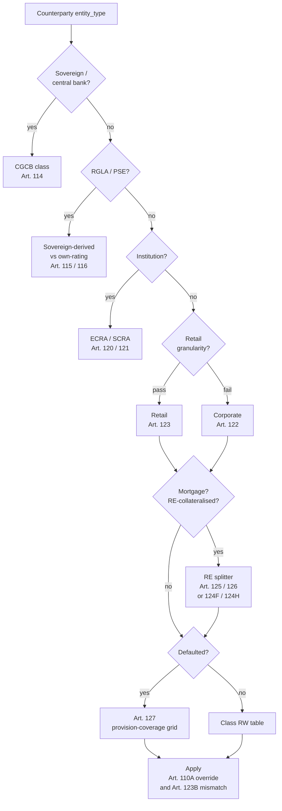

*The Standardised Approach is supposed to be the simple framework. It is — once classification has done the regulatory work that IRB hides inside its models.*

Published 2026-05-26. Code references are pinned to commit [`cceaee4`](https://github.com/OpenAfterHours/rwa_calculator/tree/cceaee4).

---

This is post 3 in the series on building this UK Basel 3.1 RWA calculator. Post 2 ([The Pipeline: Why Regulation Forced an Immutable Design](2026-05-12-the-pipeline.md)) was about how the architecture is shaped by audit demands. This post is about the regulation: specifically, why the Standardised Approach to credit risk — the framework for institutions that do not run internal models — looks like a set of lookup tables and is not, in fact, a set of lookup tables.

## The £1m loan that has at least six right answers

Suppose a UK bank holds a £1,000,000 loan to a manufacturing SME, secured by a residential property valued at £1,250,000 (LTV 80%). What is the risk weight?

The reader who has skimmed a Basel summary deck will say: corporate, SME — 75% under CRR, 85% under Basel 3.1. Multiply by the £1m EAD. Done.

That answer is wrong six different ways. To compute it correctly you need to settle, in this order:

1. **Is the borrower actually classified as corporate-SME?** If the bank's connected-client exposure to the borrower is below the retail granularity threshold and the loan is part of a sufficiently diversified retail pool, this is a retail exposure, not a corporate one.
2. **Is the property eligible real-estate collateral?** Under PS1/26 Art. 124D, the property must be valued by an independent valuer using prudent criteria, not the loan-application figure. Self-build properties get a floor. Markets that have moved >10% trigger revaluation. Pre-2027 transitional rules apply.
3. **Does this exposure fall under the loan-splitter at all?** Under CRR Art. 125 it does, with an 80% LTV cap and a 35% secured risk weight. Under PS1/26 Art. 124F it does, with a 55% LTV cap and a 20% secured risk weight. The two regimes give materially different splits and materially different residual risk weights on the unsecured slice.
4. **Is the borrower an SME under Art. 4(1)(39) connected-client aggregation?** SME-ness is a property of the obligor's group, not the loan. CRR applies a supporting factor (Art. 501) to the SME RW; Basel 3.1 does not.
5. **Is the exposure defaulted?** A defaulted loan is governed by Art. 127's provision-coverage grid, not the base-class table. The base RW is replaced, not adjusted.
6. **Has the bank performed due diligence under PS1/26 Art. 110A?** Under Basel 3.1, every non-exempt SA exposure requires firm-level due diligence; if the firm's internal assessment shows the calculated RW understates risk, the firm must apply an uplifted RW. The override floors the calculator's number.

None of these is a lookup. Each is a regulatory judgement that has to be made before the lookup tables apply. The rest of this post is about why that is the actual content of "Standardised Approach," and why the codebase has a 1,566-line classifier and a 127-line table of split parameters before the calculator looks up its first risk weight.

## Classification is upstream of the risk weight

The calculator's classifier ([`engine/classifier.py`](https://github.com/OpenAfterHours/rwa_calculator/blob/cceaee4/src/rwa_calc/engine/classifier.py)) has to map every exposure to one of seventeen exposure classes before any risk weight is read. It does so by composing an `entity_type` (a property of the counterparty), an `exposure_type` (a property of the contract), and a stack of regulatory predicates (granularity, SME criteria, default, specialised lending, real-estate collateral, currency mismatch, model permissions). Two parallel maps run in parallel — one for SA, one for IRB — because the same counterparty can land in different classes depending on the approach.

```python
ENTITY_TYPE_TO_SA_CLASS: dict[str, str] = {
    "sovereign": ExposureClass.CENTRAL_GOVT_CENTRAL_BANK.value,
    "central_bank": ExposureClass.CENTRAL_GOVT_CENTRAL_BANK.value,
    "rgla_sovereign": ExposureClass.RGLA.value,
    "rgla_institution": ExposureClass.RGLA.value,
    "pse_sovereign": ExposureClass.PSE.value,
    "pse_institution": ExposureClass.PSE.value,
    "mdb": ExposureClass.MDB.value,
    # ...
    "corporate": ExposureClass.CORPORATE.value,
    "individual": ExposureClass.RETAIL_OTHER.value,
    "specialised_lending": ExposureClass.CORPORATE.value,  # Art. 112(1)(g)
    "high_risk": ExposureClass.HIGH_RISK.value,
    # ...
}
```

(Trimmed from [`engine/classifier.py:74`](https://github.com/OpenAfterHours/rwa_calculator/blob/cceaee4/src/rwa_calc/engine/classifier.py#L74-L108).)

The `rgla_*` and `pse_*` rows on the left of that map look redundant — why distinguish a sovereign-treated regional government from an institution-treated one? Because under CRR Art. 115 a regional or local authority can either be treated as the sovereign (Table 1A, sovereign CQS-derived weights) or as an institution (Art. 115(1)(a) routing through the institution table). The same counterparty has two possible exposure classes; the right answer depends on the supervisor's designation, the currency of denomination, and — under PS1/26 Art. 147A(1)(a) — on whether the IRB approach is permitted at all. We had a fix in [version 0.1.63](../appendix/changelog.md) where `rgla_institution` and `pse_institution` counterparties carrying internal ratings were silently routed to SA regardless of IRB permissions, because the permission expressions were keyed on the SA exposure class and the SA map sent them to RGLA/PSE while the IRB permission table only listed CGCB/INSTITUTION. The fix was to key permissions on the IRB exposure class. The lesson was that "what class is this exposure?" is genuinely a two-answer question.

The classifier resolves all of this in four batched `.with_columns()` calls, deliberately shallow to keep Polars' query plan from segfaulting on deep trees. By the time the SA calculator gets a row, it has an `exposure_class`, an `approach`, a `cqs` (where ECAI ratings exist), an `internal_pd` (where internal ratings exist), and a stack of flags — `is_defaulted`, `is_sme`, `is_qualifying_re`, `re_split_mode`, `is_payroll_loan`, `qualifies_for_zero_haircut`. Only then does the lookup table apply.

## ECRA, SCRA, and the dual-regime problem

Basel 3.1 introduces a wrinkle that CRR does not have. Under CRR, an external credit rating from a recognised ECAI maps to a Credit Quality Step (CQS) via the standard mapping; the calculator looks up the institution risk weight on Table 3 by CQS. One regime, one table.

Under PS1/26, institutions can be risk-weighted under one of *two* regimes:

- **ECRA** (External Credit Risk Assessment Approach, Art. 120) — uses external ratings via CQS, mapped to a six-step institution risk-weight table. Approximately the CRR position.
- **SCRA** (Standardised Credit Risk Assessment, Art. 121) — uses three institution grades (A, B, C) determined by the bank's own assessment of the counterparty against published criteria. Used where ECRA is not chosen, or for unrated counterparties.

The choice between ECRA and SCRA is at the firm's discretion (with supervisor approval) and applies portfolio-wide, not per-exposure. SCRA also carries a sovereign floor for foreign-currency exposures under Art. 121(6), with a self-liquidating trade-finance carve-out for short-term exposures — meaning an SCRA-rated bank exposure can still hit the sovereign's CQS-derived risk weight in some currency configurations. The implementation in `engine/sa/namespace.py` has separate expression chains for the two regimes; the classifier emits an `institution_grade` column when SCRA is selected and a `cqs` column when ECRA is.

Even within a single regime, multi-rating resolution is non-trivial. CRR Art. 138 says: with one rating, use it; with two ratings, take the higher risk weight; with three or more, take the second-best CQS. We had a fix in [version 0.1.63](../appendix/changelog.md) where the rating inheritance helper had been collapsing multiple external ratings to "most recent wins," silently ignoring assessments from additional nominated ECAIs. Under the older logic, a counterparty with three Aa ratings and one B rating could be assigned the B if it was the most recent. The fix was to apply Art. 138's per-agency dedup followed by the position-based selection rule.

The point of all this is that "look up the CQS in the institution table" is two or three regulatory decisions deep before the lookup itself.

## The real-estate splitter: the cleanest example of "not a lookup"

Back to the £1m SME loan secured by a £1.25m residential property. Under both CRR and PS1/26, this exposure is *physically partitioned* into two synthetic rows by the loan-splitter ([`engine/re_splitter.py`](https://github.com/OpenAfterHours/rwa_calculator/blob/cceaee4/src/rwa_calc/engine/re_splitter.py)). Each row is then risk-weighted independently. The splitter's parameters live in a small table:

```python
RE_SPLIT_PARAMS_CRR_RESIDENTIAL = SplitParameters(
    secured_ltv_cap=Decimal("0.80"),
    secured_rw=Decimal("0.35"),
    target_class=ExposureClass.RESIDENTIAL_MORTGAGE.value,
)

RE_SPLIT_PARAMS_B31_RESIDENTIAL = SplitParameters(
    secured_ltv_cap=Decimal("0.55"),
    secured_rw=Decimal("0.20"),
    target_class=ExposureClass.RESIDENTIAL_MORTGAGE.value,
    uses_prior_charge_reduction=True,
)
```

(From [`data/tables/re_split_parameters.py:74`](https://github.com/OpenAfterHours/rwa_calculator/blob/cceaee4/src/rwa_calc/data/tables/re_split_parameters.py#L74-L94).)

Walk the £1m / £1.25m loan through both regimes:

**Under CRR Art. 125.** The secured cap is 80% LTV — that is, 80% of the property value, or £1,000,000. The whole £1m loan fits under the cap. The exposure is reclassified to `RESIDENTIAL_MORTGAGE` with a 35% risk weight, and the residual row is empty. Effective RW: 35%. With the SME supporting factor (Art. 501) applied to the obligor — assuming the connected-client exposure is below EUR 2.5m — the effective RW drops to ~26.7%.

**Under PS1/26 Art. 124F.** The secured cap is 55% of the property value, or £687,500 (less any prior charges per Art. 124F(2) — assume none here). That part of the loan is reclassified to `RESIDENTIAL_MORTGAGE` with a 20% risk weight. The residual £312,500 is *not* reclassified — it stays in its original class with its original counterparty's risk weight, modulated by the Art. 124L counterparty-type table for the residual. The SME supporting factor is removed under Basel 3.1. So the same £1m exposure, with the same property collateral, the same SME borrower, generates two different secured/residual splits, two different risk-weight bases, and the loss of the supporting factor.

The size of the difference depends entirely on the property value, the prior charges, the borrower's exposure-class for the residual, and whether the Art. 110A due-diligence override is engaged. None of that is a lookup. None of it is automatable from the loan record alone.

There is also a third path. If the same loan were secured by a *commercial* property, under CRR Art. 126 the splitter would only apply when the rental income covered ≥1.5x interest costs (the rental-coverage test). Without that test passing, no split is performed, the exposure stays in its original class, and a [version 0.1.63](../appendix/changelog.md) `RE004` informational warning is emitted in the audit trail. Under PS1/26 Art. 124H, the splitter applies for natural-person and SME borrowers but is replaced for *other* corporate borrowers by an Art. 124H(3) whole-loan formula — `max(60%, min(counterparty_rw, Art. 124I_rw))`. A single product type, three regimes, three calculation paths.

## Retail is aggregate, not per-row

The second-cleanest example. Under CRR Art. 123 and PS1/26 Art. 123A, a loan only qualifies as "retail" if three things are true: the obligor is a natural person or an SME; the exposure is part of a sufficiently granular pool; and the total exposure to the connected-client group is below a threshold (EUR 1m under CRR; the GBP equivalent under PS1/26).

That threshold is on the *group of connected clients*, not on the single loan. A counterparty with three GBP 400,000 loans and no formal lending-group reference looks below the threshold on each row but is over £1.2m in aggregate — which exceeds the regulatory ceiling. We had a [version 0.1.65](../appendix/changelog.md) fix where the hierarchy resolver was setting the lending-group total to zero when no explicit group was defined; the classifier then compared the per-row exposure against the threshold and admitted a non-retail counterparty. The fix was to default the lending-group total to a `sum().over("counterparty_reference")` aggregate — a counterparty with no group is a group of one, and the connected-client aggregation has to happen anyway. Without that aggregation, the classifier's "retail or corporate" decision was structurally unreliable.

What this means in practice: the retail / corporate split is a property of the *portfolio*, not of the loan. You cannot determine the right exposure class by looking at any one row in isolation. The classifier needs the upstream `lending_group_totals` from the hierarchy resolver before it can decide; the hierarchy resolver needs the connected-client mappings; the mappings need to be reasonably complete for the classification to be reliable. The architecture from [post 2](2026-05-12-the-pipeline.md) is what makes that data flow visible — every stage's input is an explicit bundle, and the classifier's reliance on the lending-group totals is a single, traceable dependency rather than an implicit shared global.

## Defaulted exposures are their own grid

Article 127 (CRR and PS1/26 alike) governs defaulted exposures. The base-class risk weight is *replaced*, not adjusted. The replacement risk weight depends on the ratio of specific provisions to the unsecured exposure: with provisions ≥20% of unsecured EAD, the RW is 100%; otherwise 150%. PS1/26 also flat-100%s defaulted residential RE that meets the "non-income-producing" criterion (Art. 127(3)).

The not-obvious bit is that defaulted-exposure handling does not interact cleanly with the secured/unsecured split. A defaulted retail loan with non-financial real-estate collateral does *not* get the 75% retail RW on the secured part; the whole post-CRM exposure is governed by Art. 127's provision grid. We had a [version 0.2.0](../appendix/changelog.md) fix where the defaulted SA path had been computing a `secured_pct = (collateral_re_value + collateral_receivables_value + collateral_other_physical_value) / ead` and blending the provision-driven RW with the base class RW — so a defaulted retail loan with non-financial collateral was returning 75%, the base retail RW, instead of the Art. 127 100% or 150%. Article 127(2) defers to the CRM method the institution applies; under FCCM (the default for SA) eligible financial collateral has already reduced post-CRM EAD upstream and eligible RE has been routed through class reclassification. The post-CRM value *is* the unsecured portion. No secondary split inside the defaulted override is needed; doing one was understating capital.

It is the kind of bug that is invisible if you are doing per-loan spot checks and impossible to miss if you are running an acceptance scenario with a defaulted retail loan and a hand-derived expected RW. The audit-traceability story from post 2 is exactly what made the bug locatable: the per-stage bundle let us point at the input EAD before and after CRM, the post-CRM RW assignment, and the Art. 127 override path, all separately.

## The shape of classification



Each diamond in that diagram is a regulatory judgement. Each judgement has a citation. None of them are looked up; all of them are decided.

## What "lookup table" actually meant

The mental model "SA is the simple framework, IRB is the hard one" comes from comparing the published risk-weight grids. SA has a few small tables — institutions, corporates, retail, RRE — with single-digit numbers of rows. IRB has a regression formula with five inputs, two-level correlations, and an expected-loss term. The grids are smaller; therefore SA is simpler.

The comparison ignores the routing. IRB hides classification inside the model: if you have permission to use the corporate-SME model, you use it for every corporate-SME exposure, and the correlation formula does the regulatory work. SA exposes classification: every Art. 122 vs Art. 123 vs Art. 125 decision is a regulatory judgement made in the calculator. The lookup tables are small *because* the routing logic above them does most of the actual work.

This has practical consequences. Banks that move from SA to IRB report (as a recurring source of pain) that the IRB model "doesn't know about" cases SA handled correctly: SME granularity boundaries, real-estate collateral that fails the rental coverage test, defaulted exposures where the collateral split was being computed wrong. The IRB calibration data was generated by an SA process that was making those judgements, and the model inherits the outputs without inheriting the rules. The reverse is also true: a bank that moves from IRB back to SA (or builds a new SA branch under the Basel 3.1 output floor) has to *reconstruct* the classification logic that the IRB models had absorbed.

The real description of the Standardised Approach is not "the simple one." It is "the framework where every regulatory judgement is visible." That is harder to write code for. It is also exactly what makes SA the instrument that the output floor uses: every IRB exposure has to have an SA-equivalent risk weight under PS1/26 Art. 92(2A), and the way you produce that number is to drag the IRB exposure back through the classification pipeline that IRB skipped.

Post 4 in the series turns from regulation back to engineering: how `loop.sh` and a four-stage agent pipeline write this codebase, and what the gates around them have to do to keep agent-written code regulatory-grade.

---

**Read next:** *Building With an Agent Swarm: How `loop.sh` Writes This Codebase* (in progress).

**Further reading:**

- [Specifications: SA Risk Weights (CRR)](../specifications/crr/sa-risk-weights.md) — the full per-class CRR risk-weight tables.
- [Specifications: SA Risk Weights (Basel 3.1)](../specifications/basel31/sa-risk-weights.md) — the PS1/26 versions, plus due-diligence and currency-mismatch.
- [User Guide: Exposure Classes](../user-guide/exposure-classes/index.md) — narrative overviews of each class.
- [PRA PS1/26 — Implementation of the Basel 3.1 final rules](https://www.bankofengland.co.uk/prudential-regulation/publication/2026/january/implementation-of-the-basel-3-1-final-rules-policy-statement).
